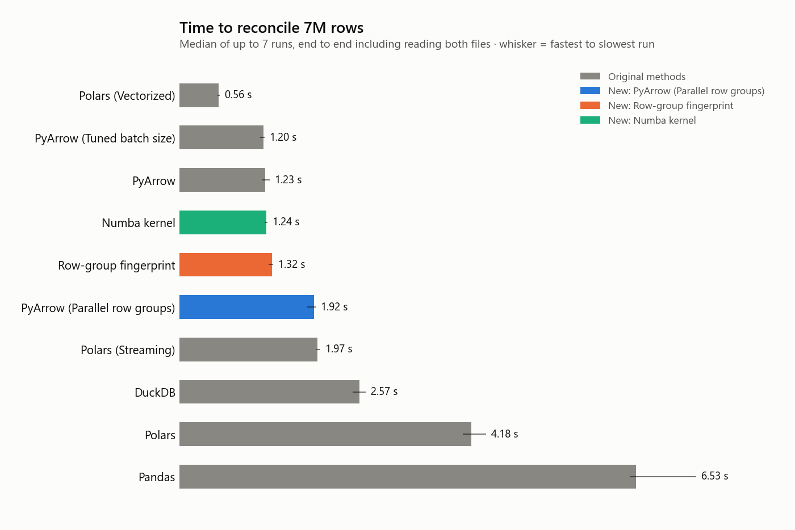
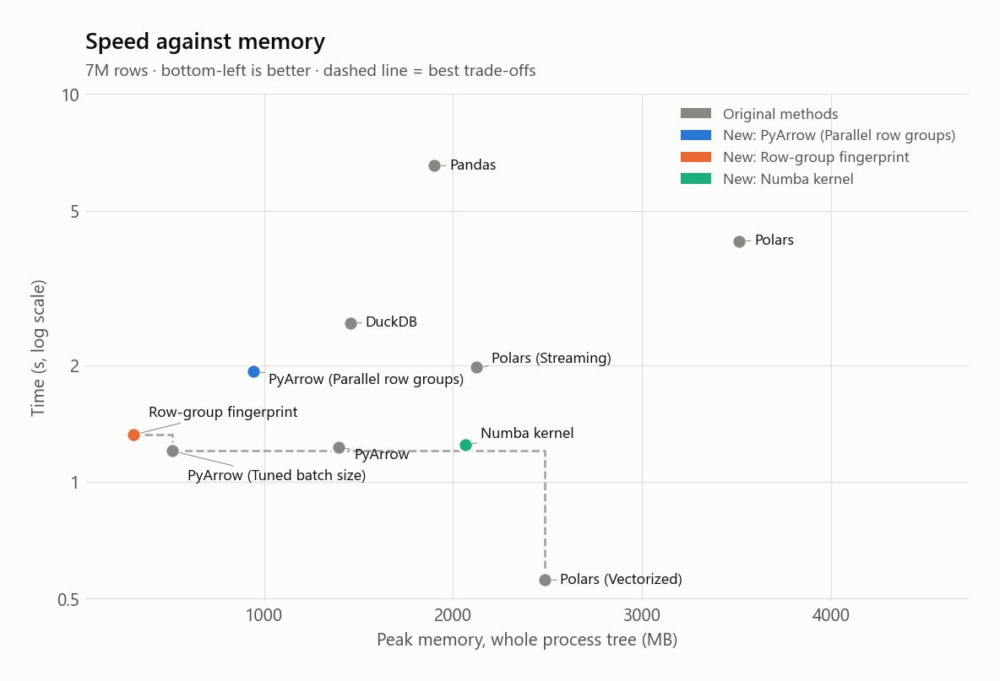
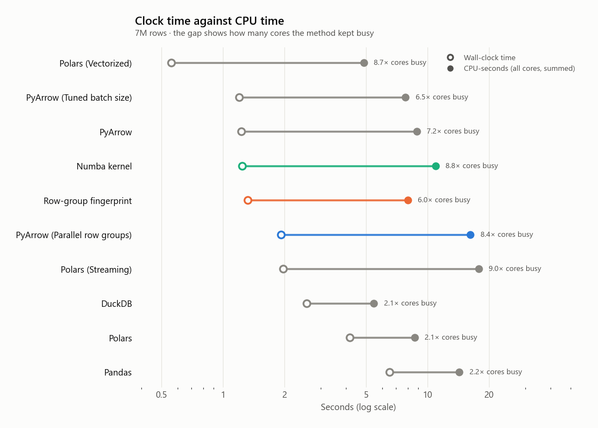
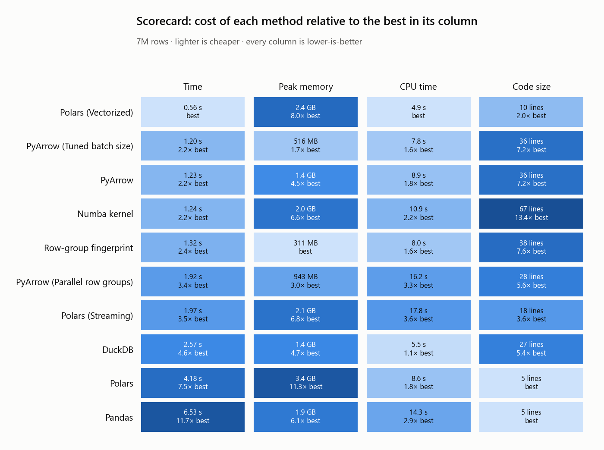
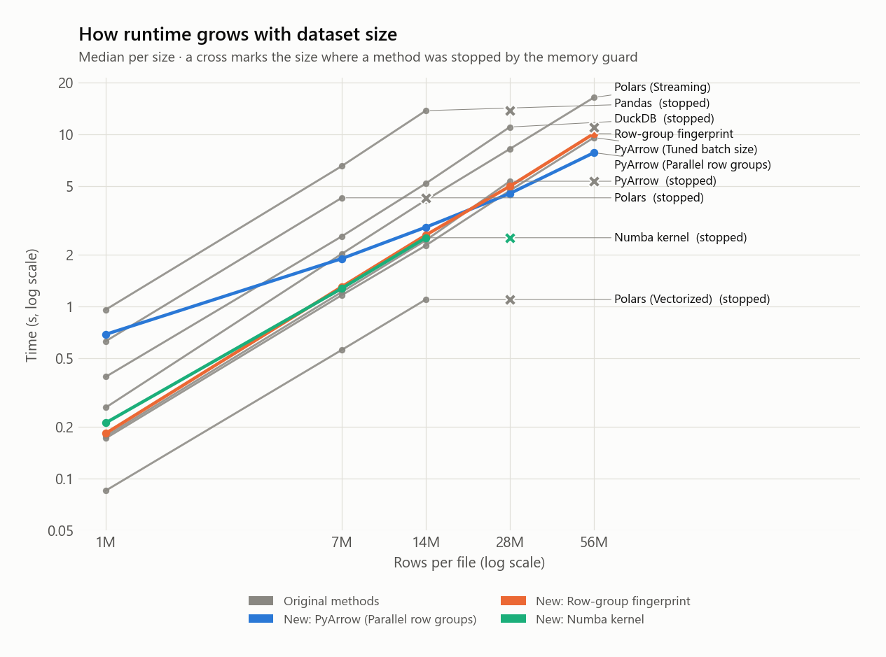
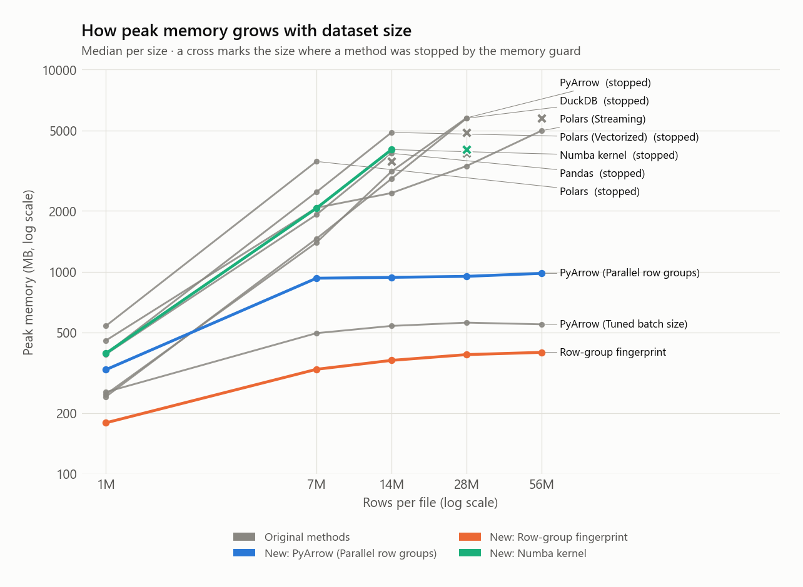
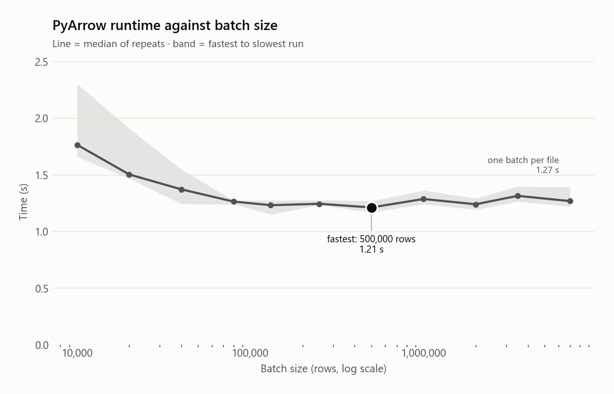
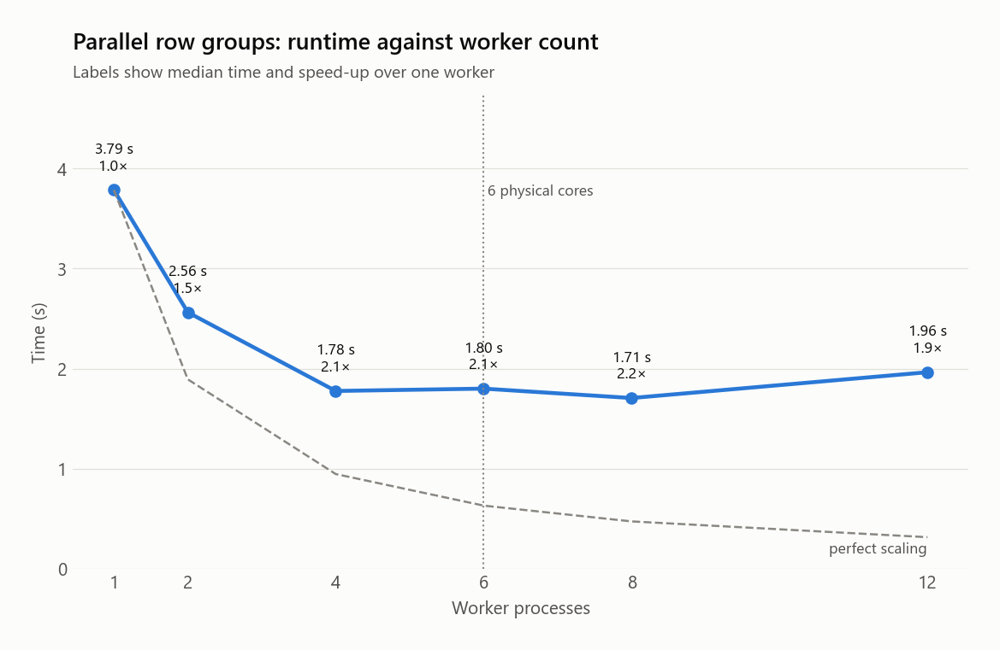
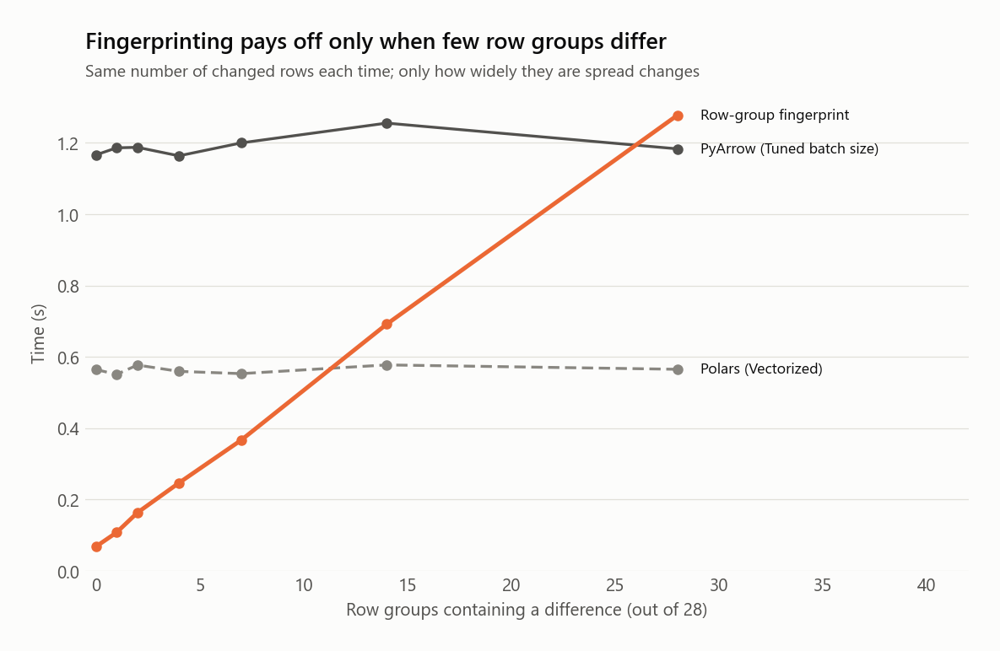

# Accelerating Tabular Reconciliation

*A benchmark of execution strategies for row-level comparison of large datasets*

**0.56 s** fastest: Polars (Vectorized) · **12×** faster than the slowest (Pandas, 6.53 s) · **311 MB** lowest peak memory: Row-group fingerprint · **4.9 s** least CPU time: Polars (Vectorized)


## Summary

An analyst has been asked to reconcile two extracts of 7M rows and 12 columns, and the book closes soon. Ten ways of comparing them were measured: seven from the original study and three added here. On this machine the slowest took 12× as long as the fastest, with every method given the same data, the same machine and the same answer to reach.

Of the three new methods: **PyArrow (Parallel row groups)** took 1.92 s (3.4× the time of the best original method, Polars (Vectorized)); **Row-group fingerprint** took 1.32 s (2.4× the time of the best original method, Polars (Vectorized)); **Numba kernel** took 1.24 s (2.2× the time of the best original method, Polars (Vectorized)). The numbers alone do not tell the whole story, because each method trades something away; see the scorecard and the decision guide.

Every method returned the correct answer on every run: each result was checked against the set of changed rows recorded when the data was generated.


### Key findings

- **Fastest is not the cheapest.** Polars (Vectorized) took 0.56 s but peaked at 2.4 GB; PyArrow (Tuned batch size) took 1.20 s (2.2× longer) and peaked at 516 MB (4.8× less memory).
- **Memory decides what scales.** At 56M rows only 4 of 10 methods finished on this machine; stopped: Pandas, Polars, DuckDB, PyArrow, Polars (Vectorized), Numba kernel. Finishers: PyArrow (Parallel row groups), PyArrow (Tuned batch size), Row-group fingerprint, Polars (Streaming).
- **The ranking changes with size.** At 56M rows the fastest finisher was PyArrow (Parallel row groups) (7.81 s), not Polars (Vectorized), which was fastest at 7M rows.
- **Parallelism costs CPU.** Parallel row groups kept 8.4 cores busy and used 16.2 CPU-seconds, 3.3× the CPU of Polars (Vectorized), yet was slower at 7M rows.
- **Skipping beats speeding up, if the data allows.** The fingerprint method took 68 ms on identical files and 0.11 s when one row group differed, but gains nothing once the differences touch every row group.
- **Hand-written code is not automatically faster.** The Numba kernel (67 lines) took 1.24 s, against 1.23 s for PyArrow (36 lines), and needs a one-off compile.


## 1. Scenario and research question

A data analyst owns a month-end reconciliation. Two systems each produce a file of the same shape, and the question is how many rows agree. The files have grown from thousands of rows to millions, the spreadsheet no longer opens, and the deadline has not moved. The analyst can reach for a different library, change how the data is read, use more of the machine, or avoid doing part of the work.

**Research question.** For a row-by-row comparison of two large tables, which execution strategy gives the shortest time to an answer, and what does each one cost in memory, CPU and complexity?


## 2. How the study was run

- **Workload.** Two Parquet files of 7,000,000 rows each: a row number, ten one-letter string columns and an integer value. The second file is a copy in which 200 rows (0.0029%) were altered at random positions. The answer to be reproduced is a match rate of 0.999971. The comparison is positional: row *i* of one file against row *i* of the other.
- **Ground truth.** The generator records which rows it changed, so correctness is verified on every run rather than assumed.
- **Isolation.** Each measurement is a fresh Python process. Library imports happen before the clock starts; the timed region is reading both files and computing the match rate. Methods are interleaved round-robin over 7 repeats so that drift in machine load is spread across them. The file cache is warm.
- **Cost axes.** *Time* is wall-clock for the timed region. *Memory* is the peak of the summed private memory of the process and any worker processes it started. *CPU time* is the CPU-seconds consumed by all threads and processes; divided by wall time it shows how many cores were kept busy. *Code size* is the number of non-blank, non-comment lines in the method module, a rough proxy for what the analyst must write and maintain.
- **Safety.** A memory guard stops any run that would exhaust the machine and records the method as unable to handle that size.

| Machine |  |
|---|---|
| Operating system | Windows-10-10.0.26200-SP0 |
| CPU | 6 physical cores, 12 threads |
| Memory | 13.9 GB RAM |
| Python | 3.11.9 |
| Libraries | pandas 2.3.3, polars 1.34.0, duckdb 1.4.1, pyarrow 21.0.0, numba 0.68.0, numpy 1.26.2 |


## 3. The methods

The first seven come from the original study; the last three are new. “Exactness” says whether the answer can ever be wrong in principle; “nulls” records how a missing value in both files is treated, which differs between methods even though this workload contains no nulls.

#### Pandas — *Original study*

Loads both files into DataFrames and tests every cell with `(df1 == df2).all(axis=1)`. The approach most analysts would write first.

**Trade-off.** Shortest and most familiar code. String columns are held as Python objects, which costs memory, and comparing them cell by cell is single-threaded.

- Exactness: Exact
- Nulls: NaN != NaN (null rows count as mismatches)
- Code size: 5 lines
- Result at 7M rows: 6.53 s · 1.9 GB · 14.3 s CPU

#### Polars — *Original study*

Reads both files eagerly into Polars frames, compares them cell by cell, then counts the all-true rows by iterating Python tuples.

**Trade-off.** Fast reader and comparison, but turning every row into a Python tuple hands back much of the gain.

- Exactness: Exact
- Nulls: null propagates (null rows are not counted as matches)
- Code size: 5 lines
- Result at 7M rows: 4.18 s · 3.4 GB · 8.6 s CPU

#### DuckDB — *Original study*

Expresses the comparison as SQL: number the rows of each file, join on the row number and average a null-safe equality across every column.

**Trade-off.** Declarative, multi-threaded and null-safe. The row-number join costs memory, and matching by position relies on the engine returning rows in file order.

- Exactness: Exact
- Nulls: null == null counts as a match (IS NOT DISTINCT FROM)
- Code size: 27 lines
- Result at 7M rows: 2.57 s · 1.4 GB · 5.5 s CPU

#### Polars (Streaming) — *Original study*

Lazily scans both files, reduces each row to a 64-bit hash and compares the two hash streams with a join on row position, using Polars' streaming engine.

**Trade-off.** Built for bounded memory and larger-than-RAM inputs. Equality of hashes is probabilistic (a collision could hide a break) and the join adds overhead.

- Exactness: Probabilistic (64-bit row hash)
- Nulls: nulls hash to a fixed value, so null == null matches
- Code size: 18 lines
- Result at 7M rows: 1.97 s · 2.1 GB · 17.8 s CPU

#### PyArrow — *Original study*

Walks the two files in lock-step record batches and combines per-column Arrow equality kernels. The batch size is the whole table, so each file is read in a single batch.

**Trade-off.** Few moving parts and no dataframe layer, but a single huge batch means peak memory scales with the file.

- Exactness: Exact
- Nulls: null == null is not a match
- Code size: 36 lines
- Result at 7M rows: 1.23 s · 1.4 GB · 8.9 s CPU

#### PyArrow (Tuned batch size) — *Original study*

The same comparison with the batch size chosen by a sweep, trading per-batch overhead against cache locality and memory.

**Trade-off.** Smaller batches keep memory flat and data cache-resident. The best size depends on the machine and the schema, so it has to be re-measured.

- Exactness: Exact
- Nulls: null == null is not a match
- Code size: 36 lines
- Result at 7M rows: 1.20 s · 516 MB · 7.8 s CPU

#### Polars (Vectorized) — *Original study*

Reads eagerly and compares the frames purely with Polars expressions (`==`, `all_horizontal`, `mean`), so no Python-level loop runs at all.

**Trade-off.** Very short code with multi-threaded, SIMD-friendly execution. It materialises both tables plus a boolean frame of the same shape.

- Exactness: Exact
- Nulls: null propagates (null rows are not counted as matches)
- Code size: 10 lines
- Result at 7M rows: 0.56 s · 2.4 GB · 4.9 s CPU

#### PyArrow (Parallel row groups) — *New in this study*

Splits the work by Parquet row group and compares groups concurrently in a pool of worker processes, each using single-threaded PyArrow kernels.

**Trade-off.** Uses every core and bounds memory by row-group size. Each worker pays process start-up and its own library imports, and speed-up flattens once workers exceed physical cores.

- Exactness: Exact
- Nulls: null == null is not a match
- Code size: 28 lines
- Result at 7M rows: 1.92 s · 943 MB · 16.2 s CPU

#### Row-group fingerprint — *New in this study*

Compares the raw compressed bytes of each Parquet row group across the two files and only decodes the groups whose bytes differ; identical groups are counted without being read as data.

**Trade-off.** Potentially orders of magnitude faster when few row groups differ, but it needs both files written with the same layout and settings, and when differences touch every group it only adds a byte-comparison pass.

- Exactness: Exact (identical bytes imply identical data)
- Nulls: identical groups match including nulls; differing groups follow PyArrow rules
- Code size: 38 lines
- Result at 7M rows: 1.32 s · 311 MB · 8.0 s CPU

#### Numba kernel — *New in this study*

Reads both files into Arrow buffers and runs a hand-written, JIT-compiled loop over the integer arrays and raw string offsets, parallelised across rows.

**Trade-off.** Closest to the hardware, with no intermediate arrays. In exchange the author owns correctness: only int64 and string columns, no null handling, a one-off JIT compile and the most code to maintain.

- Exactness: Exact (for supported types)
- Nulls: not supported (raises)
- Code size: 67 lines
- Result at 7M rows: 1.24 s · 2.0 GB · 10.9 s CPU


## 4. Results at 7M rows


### 4.1 Speed



*Median time to reconcile 7M rows over up to 7 runs per method.*

<details><summary>Data</summary>

| Method | Median | Fastest | Slowest | Runs |
|---|---|---|---|---|
| Polars (Vectorized) | 0.56 s | 0.54 s | 0.57 s | 7 |
| PyArrow (Tuned batch size) | 1.20 s | 1.15 s | 1.22 s | 7 |
| PyArrow | 1.23 s | 1.18 s | 1.29 s | 7 |
| Numba kernel | 1.24 s | 1.22 s | 1.26 s | 7 |
| Row-group fingerprint | 1.32 s | 1.27 s | 1.34 s | 7 |
| PyArrow (Parallel row groups) | 1.92 s | 1.83 s | 1.95 s | 7 |
| Polars (Streaming) | 1.97 s | 1.95 s | 2.01 s | 7 |
| DuckDB | 2.57 s | 2.48 s | 2.66 s | 7 |
| Polars | 4.18 s | 4.05 s | 4.38 s | 7 |
| Pandas | 6.53 s | 6.45 s | 7.39 s | 7 |

</details>

Polars (Vectorized) was fastest, followed by PyArrow (Tuned batch size) and PyArrow. The slowest method, Pandas, took 12× longer.


### 4.2 Speed against memory



*Each point is one method. The dashed line joins the methods that no other method beats on both axes.*

<details><summary>Data</summary>

| Method | Peak memory | Median time |
|---|---|---|
| Polars (Vectorized) | 2.4 GB | 0.56 s |
| PyArrow (Tuned batch size) | 516 MB | 1.20 s |
| PyArrow | 1.4 GB | 1.23 s |
| Numba kernel | 2.0 GB | 1.24 s |
| Row-group fingerprint | 311 MB | 1.32 s |
| PyArrow (Parallel row groups) | 943 MB | 1.92 s |
| Polars (Streaming) | 2.1 GB | 1.97 s |
| DuckDB | 1.4 GB | 2.57 s |
| Polars | 3.4 GB | 4.18 s |
| Pandas | 1.9 GB | 6.53 s |

</details>

Memory ranges from 311 MB (Row-group fingerprint) to 3.4 GB (Polars). Methods near the origin are both fast and light; a method that is fast only because it loads everything into memory will stop being an option when the data outgrows the machine (see section 5).


### 4.3 CPU cost



*Wall-clock time (open circle) against total CPU time (filled circle) per method.*

<details><summary>Data</summary>

| Method | Wall | CPU time | Cores busy |
|---|---|---|---|
| Polars (Vectorized) | 0.56 s | 4.88 s | 8.7 |
| PyArrow (Tuned batch size) | 1.20 s | 7.80 s | 6.5 |
| PyArrow | 1.23 s | 8.86 s | 7.2 |
| Numba kernel | 1.24 s | 10.94 s | 8.8 |
| Row-group fingerprint | 1.32 s | 8.00 s | 6.0 |
| PyArrow (Parallel row groups) | 1.92 s | 16.19 s | 8.4 |
| Polars (Streaming) | 1.97 s | 17.77 s | 9.0 |
| DuckDB | 2.57 s | 5.47 s | 2.1 |
| Polars | 4.18 s | 8.64 s | 2.1 |
| Pandas | 6.53 s | 14.27 s | 2.2 |

</details>

CPU time matters when the machine is shared or billed by the core-second. Wall-clock time hides how much work was done: among the five fastest methods, total CPU time differs by 2.2×. The parallel row-group method kept 8.4 cores busy on average and used 16.2 CPU-seconds, against 4.9 for Polars (Vectorized).


### 4.4 Scorecard



*Each cell shows the value and how many times worse it is than the best method in that column.*

<details><summary>Data</summary>

| Method | Time | Peak memory | CPU time | Code size |
|---|---|---|---|---|
| Polars (Vectorized) | 0.56 s | 2.4 GB | 4.9 s | 10 lines |
| PyArrow (Tuned batch size) | 1.20 s | 516 MB | 7.8 s | 36 lines |
| PyArrow | 1.23 s | 1.4 GB | 8.9 s | 36 lines |
| Numba kernel | 1.24 s | 2.0 GB | 10.9 s | 67 lines |
| Row-group fingerprint | 1.32 s | 311 MB | 8.0 s | 38 lines |
| PyArrow (Parallel row groups) | 1.92 s | 943 MB | 16.2 s | 28 lines |
| Polars (Streaming) | 1.97 s | 2.1 GB | 17.8 s | 18 lines |
| DuckDB | 2.57 s | 1.4 GB | 5.5 s | 27 lines |
| Polars | 4.18 s | 3.4 GB | 8.6 s | 5 lines |
| Pandas | 6.53 s | 1.9 GB | 14.3 s | 5 lines |

</details>


## 5. Scaling with dataset size

The same comparison was repeated at 1M, 7M, 14M, 28M, 56M rows per file, with the changed-row proportion held constant.



*Median time against rows per file, both axes logarithmic.*

<details><summary>Data</summary>

| Method | 1M | 7M | 14M | 28M | 56M |
|---|---|---|---|---|---|
| Pandas | 0.96 s | 6.53 s | 13.70 s | stopped | not run |
| Polars | 0.63 s | 4.27 s | stopped | not run | not run |
| DuckDB | 0.39 s | 2.55 s | 5.18 s | 11.01 s | stopped |
| Polars (Streaming) | 0.26 s | 2.02 s | 4.15 s | 8.21 s | 16.35 s |
| PyArrow | 0.18 s | 1.21 s | 2.42 s | 5.33 s | stopped |
| PyArrow (Tuned batch size) | 0.17 s | 1.16 s | 2.26 s | 4.71 s | 9.56 s |
| Polars (Vectorized) | 85 ms | 0.56 s | 1.10 s | stopped | not run |
| PyArrow (Parallel row groups) | 0.69 s | 1.89 s | 2.88 s | 4.52 s | 7.81 s |
| Row-group fingerprint | 0.18 s | 1.30 s | 2.59 s | 4.99 s | 10.08 s |
| Numba kernel | 0.21 s | 1.27 s | 2.50 s | stopped | not run |

</details>



*Peak memory against rows per file.*

<details><summary>Data</summary>

| Method | 1M | 7M | 14M | 28M | 56M |
|---|---|---|---|---|---|
| Pandas | 390 MB | 1.9 GB | 3.8 GB | stopped | not run |
| Polars | 539 MB | 3.4 GB | stopped | not run | not run |
| DuckDB | 240 MB | 1.4 GB | 2.8 GB | 5.6 GB | stopped |
| Polars (Streaming) | 456 MB | 2.0 GB | 2.4 GB | 3.3 GB | 4.9 GB |
| PyArrow | 247 MB | 1.4 GB | 3.1 GB | 5.6 GB | stopped |
| PyArrow (Tuned batch size) | 254 MB | 497 MB | 539 MB | 560 MB | 549 MB |
| Polars (Vectorized) | 392 MB | 2.4 GB | 4.8 GB | stopped | not run |
| PyArrow (Parallel row groups) | 327 MB | 928 MB | 937 MB | 948 MB | 981 MB |
| Row-group fingerprint | 179 MB | 329 MB | 364 MB | 389 MB | 399 MB |
| Numba kernel | 394 MB | 2.0 GB | 3.9 GB | stopped | not run |

</details>

On this machine the following methods were stopped by the memory guard before the largest size: Pandas (largest completed: 14M), Polars (largest completed: 7M), DuckDB (largest completed: 28M), PyArrow (largest completed: 28M), Polars (Vectorized) (largest completed: 14M), Numba kernel (largest completed: 14M). The limit is the memory actually usable on this machine at the time (13.9 GB installed, part of it taken by the operating system and background processes), not a fixed property of each method; on a larger machine the cut-off moves, but the order in which methods fail would not. A method that cannot finish is the slowest possible method, whatever it scored on a smaller file.

At 56M rows the fastest completed method was PyArrow (Parallel row groups) (7.81 s) and the lightest was Row-group fingerprint (399 MB).


## 6. Sensitivity studies

Three of the methods depend on a setting or on the shape of the data. These studies show how much.


### 6.1 PyArrow batch size



*Runtime of the PyArrow method against the number of rows read per batch.*

<details><summary>Data</summary>

| Batch size | Median time |
|---|---|
| 10,000 | 1.76 s |
| 20,000 | 1.50 s |
| 40,000 | 1.37 s |
| 80,000 | 1.26 s |
| 131,072 | 1.23 s |
| 250,000 | 1.24 s |
| 500,000 | 1.21 s |
| 1,000,000 | 1.29 s |
| 2,000,000 | 1.24 s |
| 3,500,000 | 1.31 s |
| 7,000,000 | 1.27 s |

</details>

The fastest batch size was 500,000 rows (1.21 s); reading each file as one batch took 1.27 s and the smallest batch size took 1.76 s. Above roughly 500,000 rows the curve is flat, so tuning changes the runtime by only 4%. The larger effect is on memory: the single-batch method peaked at 1.4 GB, the tuned one at 516 MB (2.7× less), because only one batch is held at a time. Very small batches pay per-batch overhead. The best size is specific to this machine and data, so it should be measured rather than assumed. The sweep uses repeats and medians; the original version took the minimum of single runs, which favours noise.


### 6.2 Parallel row groups: how many workers?



*Runtime of the parallel method against the number of worker processes.*

<details><summary>Data</summary>

| Workers | Median time | Speed-up vs 1 worker |
|---|---|---|
| 1 | 3.79 s | 1.0× |
| 2 | 2.56 s | 1.5× |
| 4 | 1.78 s | 2.1× |
| 6 | 1.80 s | 2.1× |
| 8 | 1.71 s | 2.2× |
| 12 | 1.96 s | 1.9× |

</details>

Best was 8 workers at 1.71 s, 2.2× faster than one worker, which is well short of the ideal (28% parallel efficiency). Every worker is a separate process that must start, import its libraries and read its share of the file, and the machine has 6 physical cores (12 threads). The number of row groups (28) also caps how finely the work can be divided.


### 6.3 Fingerprinting: how widely are the differences spread?



*Runtime against the number of row groups (of 28) that contain a difference. The total number of changed rows is the same in every case.*

<details><summary>Data</summary>

| Row groups differing | Row-group fingerprint | PyArrow (Tuned batch size) | Polars (Vectorized) |
|---|---|---|---|
| 0 | 68 ms | 1.17 s | 0.56 s |
| 1 | 0.11 s | 1.19 s | 0.55 s |
| 2 | 0.16 s | 1.19 s | 0.58 s |
| 4 | 0.25 s | 1.16 s | 0.56 s |
| 7 | 0.37 s | 1.20 s | 0.55 s |
| 14 | 0.69 s | 1.26 s | 0.58 s |
| 28 | 1.28 s | 1.18 s | 0.57 s |

</details>

With identical files the fingerprint method finished in 68 ms, against 1.17 s for PyArrow (Tuned batch size). It was clearly faster than PyArrow (Tuned batch size) (by more than 5%) when up to 14 of 28 row groups differed, and had no meaningful advantage from 28 differing groups onwards. The speed-up comes from not decoding unchanged data, so it depends entirely on how the differences are distributed: in the main benchmark the 200 changes are scattered across 28 row groups, so nearly every group is touched and there is little to skip.


### 6.4 The Numba kernel's first-call cost

A compiled kernel has a one-off cost that the benchmark excludes from the timed region: with an empty cache the first call took 3.3 s to compile; with the cache populated it took 0.7 s to load. That is irrelevant for a job that runs daily and decisive for a one-off, so it belongs in the decision.


## 7. Decision guide

| If you need… | Choose | Evidence |
|---|---|---|
| The shortest time on one machine with enough memory | Polars (Vectorized) | 0.56 s at 7M rows; 12× faster than Pandas |
| The smallest memory footprint | Row-group fingerprint | 311 MB peak at 7M rows |
| The least total CPU work (shared or billed machine) | Polars (Vectorized) | 4.9 CPU-seconds |
| The least code to write and maintain | Pandas | 5 lines |
| The largest file that still finishes (56M rows tested) | PyArrow (Parallel row groups) | 7.81 s, 981 MB; 4 of 10 methods completed this size |
| Re-checking files that are mostly unchanged and were written the same way | Row-group fingerprint | 68 ms for identical files; 0.11 s when one row group differs |
| A fixed schema, run repeatedly, where every second counts | Numba kernel | 1.24 s per run once compiled; supports only int64 and string columns, and no nulls |


## 8. Limitations

- **One machine.** Absolute times will differ elsewhere; rankings and ratios are more portable than seconds.
- **Synthetic data.** Ten one-letter columns with 26 possible values compress and compare very differently from free-text, decimal or date columns. Wider or higher-cardinality data will shift the balance, especially for the byte-level and string-comparing methods.
- **Positional comparison only.** Real reconciliations usually match on a key, tolerate rounding, and must say *which* rows broke and why. None of that is measured here, and key-based joins have a different cost profile.
- **Very sparse differences.** Only 0.003% of rows differ. Methods that produce a break report would do more work as breaks become common.
- **Parquet inputs with a shared layout.** The row-group fingerprint method needs both files written the same way. Files from two different systems almost never are, in which case it falls back to a full comparison.
- **Warm cache, local disk.** Slower storage would make reading dominate and favour methods that read less.
- **Measurement granularity.** Memory and child CPU are sampled every 20 ms, so a very short peak can be missed, and a worker's last few milliseconds of CPU are not counted. On Windows the CPU timer ticks about every 15 ms, so CPU time for runs shorter than about 100 ms is coarse.
- **Tuning in-sample.** The batch size was tuned and evaluated on the same data.
- **Null handling differs** between methods (section 3). This workload has no nulls, so the difference is invisible here but would matter on real data.


## 9. Reproducing this study

```bash
pip install -e .[dev]
python -m pytest                     # every method agrees with ground truth
python -m tabrecon all               # generate data, run every study, build this report
# or step by step:
python -m tabrecon batch-sweep       # tunes the PyArrow batch size first
python -m tabrecon benchmark --rows 7M --repeats 7
python -m tabrecon scaling --sizes 1M 7M 14M 28M 56M
python -m tabrecon report
```
